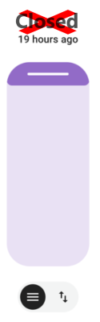

# ha-blueprint(s)
my blueprint(s) for home assistant

## 🏠 TS130F zigbee cover fix

- Fix roller shutter states according to their current position
- for Loratap models (TS130F) that do not update the Open/Closed state when operated from the physical button

 
